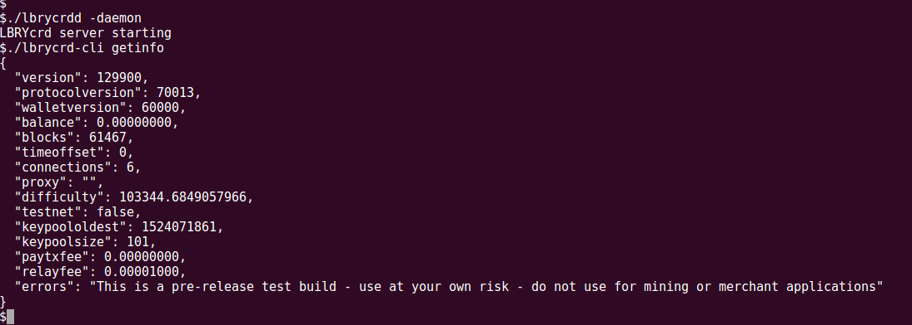

# LBRYcrd - The LBRY blockchain

LBRYcrd uses a blockchain similar to bitcoin's to implement an index and payment system for content on the LBRY network. It is a fork of bitcoin core.

## Installation

Latest binaries are available from https://github.com/lbryio/lbrycrd/releases. There is no installation procedure, the binaries run as is.

## Usage

The `lbrycrdd` executable will start a LBRYcrd node and connect you to the LBRYcrd network. Use the `lbrycrd-cli` executable
to interact with lbrycrdd through the command line. Help pages for both executable are available through
the "--help" flag (e.g. `lbrycrd-cli --help`).

### Example Usage

Run `./lbrycrdd -server -daemon` to start lbrycrdd in the background.

Run `./lbrycrd-cli getinfo` to check for some basic informations about your LBRYcrd node.

Run `./lbrycrd-cli help` to get a list of all commands that you can run. To get help on specific commands run `./lbrycrd-cli [command_name] help`

## Running from Source

Run `./reproducible_build.sh -c -t`. This will build the binaries and put them into the `./src` directory.

If you encounter any errors, please check `doc/build-*.md` for further instructions. If you're still stuck, [create an issue](https://github.com/lbryio/lbrycrd/issues/new) with the output of that command, your system info, and any other information you think might be helpful.

## Contributing

Contributions to this project are welcome, encouraged, and compensated. For more details, see [lbry.io/faq/contributing](https://lbry.io/faq/contributing)

The `master` branch is regularly built and tested, but is not guaranteed to be
completely stable. [Releases](https://github.com/lbryio/lbrycrd/releases) are created
regularly to indicate new official, stable release versions.

Testing and code review is the bottleneck for development; we get more pull
requests than we can review and test on short notice. Please be patient and help out by testing
other people's pull requests, and remember this is a security-critical project where any mistake might cost people
lots of money.

Developers are strongly encouraged to write [unit tests](/doc/unit-tests.md) for new code, and to
submit new unit tests for old code. Unit tests can be compiled and run
(assuming they weren't disabled in configure) with: `make check`

The Travis CI system makes sure that every pull request is built, and that unit and sanity tests are automatically run.

### Testnet

Testnet is maintained for testing purposes and can be accessed using the command `./lbrycrdd -testnet`. If you would like testnet credits, please contact kay@lbry.io or grin@lbry.io.

## License

This project is MIT licensed. For the full license, see [LICENSE](LICENSE).

## Security

We take security seriously. Please contact security@lbry.io regarding any security issues.
Our PGP key is [here](https://keybase.io/lbry/key.asc) if you need it.

## Contact

The primary contact for this project is [@kaykurokawa](https://github.com/kaykurokawa) (kay@lbry.io)

